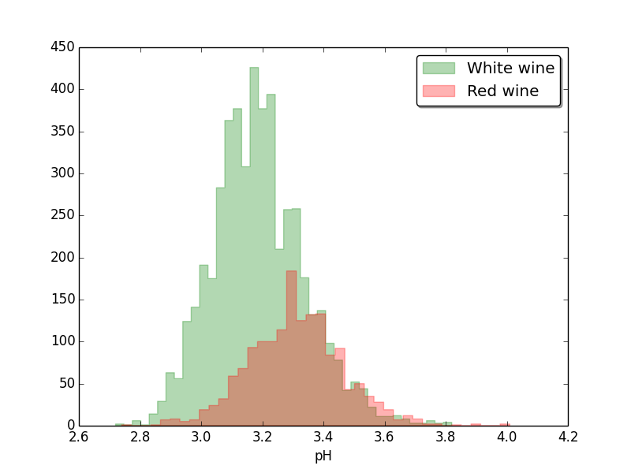
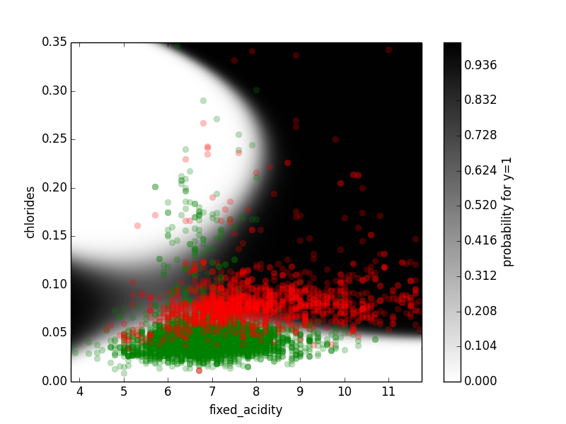

Dev Day 2013: Predictive Analytics Hands-on session
===================================================

The purpose of this session is to give a feeling of what (predictive) analytics is and how it is done, mainly for those who are familiar with coding but not so familiar with statistics or machine learning. Although R is the *Lingua franca* of analytics, we use Python because it is already to familiar to many, and easier to approach for those unfamiliar with it. With a small toy (classification) problem, we go through the steps of getting familiar with the data, devising incrementally more complex models, and applying the model to predict   for new data. There are many chances to get creative with Python coding.  

If possible, please prepare for this session by downloading the virtual machine or the relevant libraries *beforehand*. (See section "Getting ready" below.)

It is a good idea to pair up for this session. If you are not familiar with Python, it is recommended that you find someone who is.

# Useful links

Practical ones:

* [Numpy tutorial](http://wiki.scipy.org/Tentative_NumPy_Tutorial): we will not use Numpy extensively, just for light data manipulation. Numpy is the array manipulation sublanguage of Python (a bit like Matlab).
* [A short tutorial](http://pandas.pydata.org/pandas-docs/stable/10min.html) on Pandas, the Python "data frame" library. Pandas is a higher-level structure on arrays, allowing heterogeneous columns, column names, etc.
* [Logistic regression with Python](http://blog.yhathq.com/posts/logistic-regression-and-python.html) and its statsmodels package. Logistic regression is a way to make a classifier that gives out probabilities.
* [Regularized logistic regression with Python](http://scikit-learn.org/stable/modules/generated/sklearn.linear_model.LogisticRegression.html) from the [Scikit-learn](http://scikit-learn.org/) package. In practice, regularization is mandatory with larger models. You have a chance to try it at the end of the session.

More theoretical:

* [Logistic regression on Wikipedia](http://en.wikipedia.org/wiki/Logistic_regression). Easy to understand: a linear regression stacked with an S-curve to make outputs look like probabilities. But in its [full](http://fastml.com/regression-as-classification/) [glory](http://arantxa.ii.uam.es/~jmlobato/docs/slidesCambridge.pdf), a logistic regression model is far from elementary!
* Want to go deeper, with Python? Try [Probabilistic Programming and Bayesian Methods for Hackers](https://github.com/CamDavidsonPilon/Probabilistic-Programming-and-Bayesian-Methods-for-Hackers), a book freely available on Github.

# Getting ready

Even though we are working with a toy example here, our aim is to provide an environment that will be useful even for some serious work in the field of predictive analytics. Obviously we would also like our environment to have a permissive license. For these reasons, the end result is bound to be somewhat involved. You basically have two options:

## Alternative 1: Using a virtual machine

To get started quickly (?), you can use a virtual machine that we have pre-built to already contain all the necessary libraries. **You can download the virtual machine from [here](http://download.reaktor.fi/PredictiveAnalyticsHandsOn/DevDay2013-PredictiveAnalyticsHandsOn.ova).** (It's running Ubuntu.)

If you already have something like VMware installed, feel free to use it. If not, then you can download for example [VirtualBox](https://www.virtualbox.org/wiki/Downloads). In VirtualBox, you can add the machine via the Import Appliance menu item.

Please note that:

* The version of VirtualBox should be 4.2.18 or later. If not, you may run into weird problems. 
* The virtual machine is installed with Finnish keyboard settings. You may want to change this. 
* The user's password is `DevDay2013`. 

Once you have the virtual machine running, update the latest instructions and code from GitHub:

	cd ~/devday2013-predictive-analytics-hands-on
	git pull

If you don't want to use the virtual machine, feel free to install the environment directly onto your computer. The necessary libraries are listed below.

## Alternative 2: Required libraries

**Note that this section is relevant only if _not_ using the provided virtual machine.**

The data and some sample code you can get from GitHub:

	git clone https://github.com/reunanen/devday2013-predictive-analytics-hands-on

### On Linux

To run these examples, you should install the following packages (Ubuntu names used here):

* g++, gfortran
* libblas-dev, liblapack-dev
* libfreetype6-dev, libpng12-dev
* ipython, python-pip, python-dev

For Python, you need the following (installation with <a href="http://en.wikipedia.org/wiki/Pip_(package_manager)">pip</a> is recommended):

* [numpy](http://www.numpy.org/), [scipy](http://www.scipy.org/)
* [matplotlib](http://matplotlib.org/), [pandas](http://pandas.pydata.org/), [statsmodels](http://statsmodels.sourceforge.net/), [scikit-learn](http://scikit-learn.org/stable/)

### On OS X

* Make sure you have the XCode _command line tools_ installed.
* Install the GNU Fortran compiler and Freetype fonts. With [brew](http://brew.sh/) that would be `brew install gfortran freetype`
        
* Tune up the Python environment. (This should work if you use the Python provided by Apple. With, e.g., the newest Python by brew, prepare for architecture problems between various C libraries and the Python binary.)

		sudo easy_install pip
		sudo pip install --upgrade numpy
		sudo pip install scipy # If this fails, try uninstalling and reinstalling numpy
		sudo pip install pandas cython nose matplotlib ipython
		sudo pip install statsmodels scikit-learn

### On Windows

You can download the required libraries from [Christoph Gohlke's repository](http://www.lfd.uci.edu/~gohlke/pythonlibs/).

You need:

* [ipython](http://www.lfd.uci.edu/~gohlke/pythonlibs/#ipython) (perhaps not stricly necessary, but very useful)
* [numpy](http://www.lfd.uci.edu/~gohlke/pythonlibs/#numpy), [scipy](http://www.lfd.uci.edu/~gohlke/pythonlibs/#scipy)
* [matplotlib](http://www.lfd.uci.edu/~gohlke/pythonlibs/#matplotlib), [pandas](http://www.lfd.uci.edu/~gohlke/pythonlibs/#pandas), [statsmodels](http://www.lfd.uci.edu/~gohlke/pythonlibs/#statsmodels), [scikit-learn](http://www.lfd.uci.edu/~gohlke/pythonlibs/#scikit-learn)
* [dateutil](http://www.lfd.uci.edu/~gohlke/pythonlibs/#python-dateutil), [pyparsing](http://www.lfd.uci.edu/~gohlke/pythonlibs/#pyparsing)

### Testing

Run `python test-installation.py` to check package installations, data availability and basic model fitting functionality. 

# Introduction

## What is predictive analytics?

Analytics produces actionable information from observations or from results of experiments ("data sets"). The results of analytics are diverse. They may be just informative summaries of the data, with uncertainty quantified as probabilities or confidence intervals. Analytics may reveal underlying relationships, suggest causality, or new hypotheses for further testing. Sometimes the results are very operational suggestions of actions, possibly embedded into an IT system, so that humans only see the actions, not the analytics. Statistical and other kind of _models_ are used to achieve these goals.

Models of analytics do not usually try to reproduce the exact dynamics of the system under study, as for example weather models do. Instead, they are highly simplified abstractions of the world. Their structure usually just tries to take into account the surface tendencies and dependencies in the data. The simplest model structures can be applied on almost any domain, from physics to psychology to business. Because of this simplification, the models are inherently probabilistic: Things not taken into account or impossible to predict appear as uncertainty in the model.

_Predictive models_ learn relationships and patterns from historical data to forecast future events, or outcomes of actions not yet made. Models are constructed with techniques from statistics, machine learning, and data mining. Predictive analytics is applied successfully in, e.g., marketing, telecommunications, insurance, retail, and manufacturing industries.

From Wikipedia:

> [*Analytics*](http://en.wikipedia.org/wiki/Analytics) is the discovery and communication of meaningful patterns in data. Especially valuable in areas rich with recorded information, analytics relies on the simultaneous application of [statistics](http://en.wikipedia.org/wiki/Statistics), [computer programming](http://en.wikipedia.org/wiki/Computer_programming) and [operations research](http://en.wikipedia.org/wiki/Operations_research) to quantify performance. Analytics often favors [data visualization](http://en.wikipedia.org/wiki/Data_visualization) to communicate insight.

>*[Predictive analytics](http://en.wikipedia.org/wiki/Predictive_analytics)* encompasses a variety of techniques from [statistics](http://en.wikipedia.org/wiki/Statistics), [modeling](http://en.wikipedia.org/wiki/Predictive_modelling), [machine learning](http://en.wikipedia.org/wiki/Machine_learning), and [data mining](http://en.wikipedia.org/wiki/Data_mining) that analyze current and historical facts to make [predictions](http://en.wikipedia.org/wiki/Prediction) about future, or otherwise unknown, events.

(Predictive) analytics is not reporting, [web analytics](http://en.wikipedia.org/wiki/Web_analytics) or [big data](http://en.wikipedia.org/wiki/Big_data), although one can apply models to web data or large data sets, or improve reports with inference techniques.

## The Wine data

In this hands-on session, a Wine data set containing chemical measurements from red and white variants of the Portuguese "[Vinho Verde](http://en.wikipedia.org/wiki/Vinho_Verde)" wine is analyzed. The chemical measurements include the following variables:

* fixed acidity
* volatile acidity
* citric acid
* residual sugar
* chlorides
* free sulfur dioxide
* total sulfur dioxide
* density
* pH
* sulphates
* alcohol

The variables are available for 1599 red and 4898 white wines, respectively. The objective is to predict the color of wine using only the chemical measurements listed above. Note that there are no data about grapes, brand, selling price etc. available.

## The first insights

Before modelling, it is essential to get familiar with the data. Simple statistics such as mean and standard deviation give some idea of variation of the data. More visual and comprehensive strategy is to plot histograms or scatter plots of the variables. Histogram is a kind of estimate of the (probability) distribution of the variable. Below as an example is the distribution of the pH values of wines. pH values outside the range 2.9-3.6 are uncommon. The second graph shows histograms of pH values separately for red (red bars) and white (green bars).

A scatter plot shows not only variation but _covariation_ of two variables. Other information can be included. Below colours of the dots present wine type, so one sees how well the red (red dots) and white (green dots) wines are separated by these two variables.

The blue line is a _decision boundary_ that could be used to classify new wines, if only these two variables were available. In our case, the objective of modelling is to find a decision boundary such that the classification accuracy of _new, yet unseen wines_, is maximized.

A decision boundary can also be 'soft' in the sense that near the boundary we know that the correct class could really be either. Furthermore, the decision boundary can be _non-linear_. The figure below illustrates a non-linear, 'soft' decision rule.

## Logistic regression

There are numerous techniques to find a good decision boundary. The basic strategy is to optimize for the existing data, but not too well. (The problem of doing too well becomes apparent later.)

To fit a model, one usually chooses a model class, then optimizes the model with respect to some _parameters_, numbers in the model with no given values. In practice the process is iterative: the model is fitted, fine tuned, fitted again, etc.

The model class used below is [logistic regression](http://en.wikipedia.org/wiki/Logistic_regression). It is a classic techique, very simple at its core but surprisingly rich in practice. The model has a linear combination of some variables with free coefficients (to be optimized), then an S-like function (inverse [logit](http://en.wikipedia.org/wiki/Logit), quite close to tanh()) on top of that to limit the results to be between 0 and 1. With a suitable optimization technique, such an outcome becomes interpretable as [probabilities](http://en.wikipedia.org/wiki/Probability).

The input variables, or explanatory variables, are here the chemical properties of the wines, or at least a subset of them.

The optimization technique is called [maximum likelihood](http://en.wikipedia.org/wiki/Maximum_likelihood). It finds coefficients of the linear combination in the model (parameters of the model) that maximizes the probability of the observed data (wine types, red or white). (The justification for maximum likelihood arises from statistics. It can also be seen as a shortcut to Bayesian estimation. Then it arises from [conditional probability](http://en.wikipedia.org/wiki/Conditional_probability).)

Regularized models at the end of the session script use another optimization criterion, [Maximum a Posteriori (MAP)](https://en.wikipedia.org/wiki/Bayesian_interpretation_of_regularization). MAP is very close to maximum likelihood, just augmented with a preference towards simple models. 

# Hands on

The task is to devise a classifier for the colour of wine, given examples of existing wines and their eleven chemical properties (which are not directly related to colour). The step by step code is in the file [hands-on.py](https://github.com/reunanen/devday2013-predictive-analytics-hands-on/blob/master/hands-on.py). 

You may want to use a REPL to go through the steps in the code. *ipython* is preferred, although the usual *python* prompt will also do. If you write a lot of code, it is handier to use *Emacs* with its *python-mode*, or something similar, or a Python IDE like *idle*. You can also run the code with `python -i <file>` so that you have a prompt in the environment created by your code to work with. 

At any point, if you think you are lost, feel free to ask!
